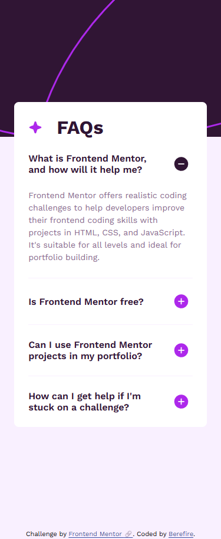
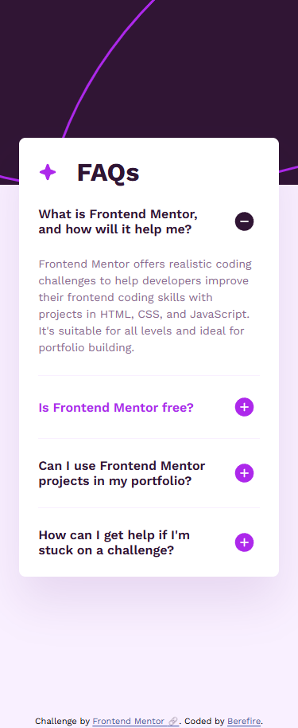
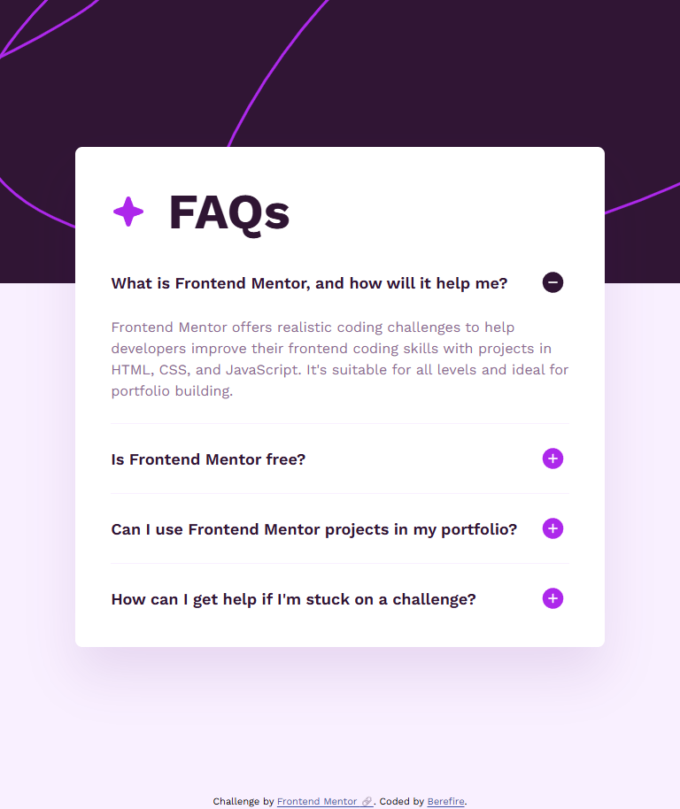
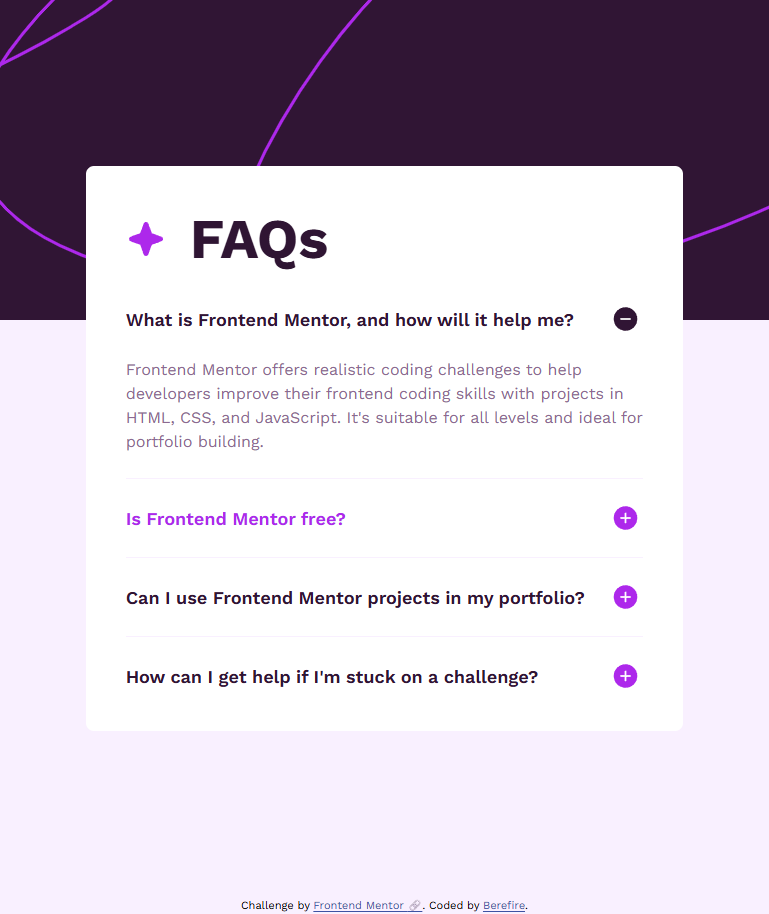
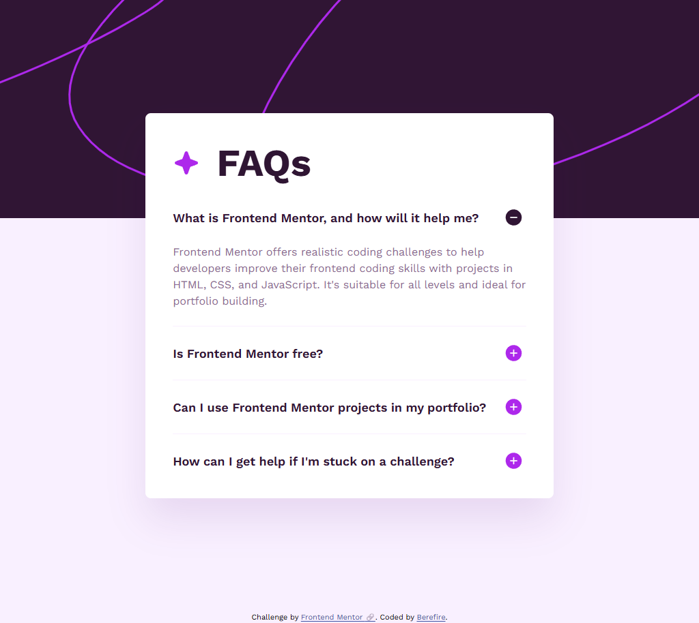
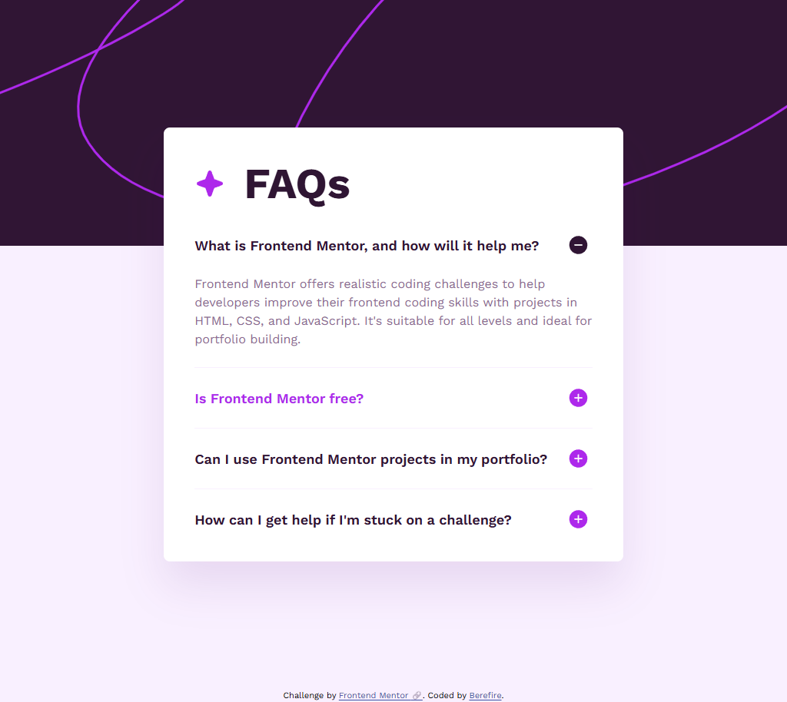

# Frontend Mentor - FAQ accordion solution


[](https://www.frontendmentor.io/)
[](https://vitejs.dev)


This is a solution to the [FAQ accordion challenge on Frontend Mentor](https://www.frontendmentor.io/challenges/faq-accordion-wyfFdeBwBz). Frontend Mentor challenges help you improve your coding skills by building realistic projects.

## Table of contents

- [Overview](#overview)
  - [The challenge](#the-challenge)
  - [Screenshot](#screenshot)
  - [Links](#links)
- [My process](#️my-process)
  - [Built with](#built-with)
  - [Architecture and organization](#architecture-and-organization)
  - [What I learned](#what-i-learned)
  - [Continued development](#continued-development)
  - [Useful resources](#useful-resources)
- [Author](#author)
- [Acknowledgments](#acknowledgments)

---

## 📖Overview

### The challenge

Users should be able to:

- Hide/Show the answer to a question when the question is clicked
- Navigate the questions and hide/show answers using keyboard navigation alone
- View the optimal layout for the interface depending on their device's screen size
- See hover and focus states for all interactive elements on the page

---

### 📸Screenshot

#### Mobile (375x914)

| _Default_ | _Active_ |
| --------- | -------- |
|  |  |

#### Tablet (768x914)

| _Default_ | _Active_ |
| --------- | -------- |
|  |  |

#### Desktop (1024x914)

| _Default_ | _Active_ |
| --------- | -------- |
|  |  |

---

### 🔗Links

- Solution URL: [https://www.frontendmentor.io/solutions/accessible-faq-accordion-with-cube-css--ehWHUoFl-](https://www.frontendmentor.io/solutions/accessible-faq-accordion-with-cube-css--ehWHUoFl-)
- Live Site URL: [https://berefire.github.io/faq-accordion/](https://berefire.github.io/faq-accordion/)

---

## ⚙️My process

### 🛠Built with

- Semantic HTML5 markup
- CSS custom properties
- Mobile-first workflow
- Flexbox
- CSS Grid
- CUBE CSS methodology
- Native `<details>` and `<summary>` elements
- Accessibility best practices

---

### Architecture and organization

This project follows a component-oriented structure inspired by CUBE CSS principles.

- Composition classes were used for layout utilities
- Semantic HTML elements were prioritized before adding classes
- Component-specific styles were separated from global styles
- Decorative backgrounds were handled independently from the accordion component
- Logical CSS properties such as `padding-block` and `border-block-end` were used to improve maintainability and writing-mode support

Example of the accordion structure:

```html
<section class="faq-card box--card cluster--card">
  <h1 class="faq-title">FAQs</h1>

  <details class="faq-item">
    <summary class="faq-question">
      What is Frontend Mentor, and how will it help me?
    </summary>

    <p class="faq-answer">
      Frontend Mentor offers realistic coding challenges...
    </p>
  </details>
</section>
```

---

### 💡What I learned

While building this project, I practiced creating accessible accordions using native HTML elements instead of relying entirely on JavaScript.

I also improved my understanding of:

- CUBE CSS architecture
- Decorative backgrounds using pseudo-elements
- Responsive background image handling
- Using CSS Grid for text/icon alignment
- Managing accordion icons with pseudo-elements
- Working with logical properties in CSS

I learned how to replace the default `<summary>` marker with custom icons:

```css
.faq-question::after {
  content: "";
  inline-size: 1.5rem;
  block-size: 1.5rem;
  background-image: url("/assets/images/icon-plus.svg");
  background-repeat: no-repeat;
  background-size: contain;
}

details[open] .faq-question::after {
  background-image: url("/assets/images/icon-minus.svg");
}
```

---

### 🚀Continued development

In future projects, I would like to continue improving:

- CSS architecture and scalability
- Accessibility patterns for interactive components
- Advanced responsive design techniques
- Better separation between layout, utilities, and components
- Performance optimization for decorative assets and backgrounds

---

### 📚Useful resources

- [CUBE CSS](https://cube.fyi/) - Helped me better understand composition-first CSS architecture.
- [MDN - details element](https://developer.mozilla.org/en-US/docs/Web/HTML/Element/details) - Useful for understanding native accordion accessibility behavior.
- [Every Layout](https://every-layout.dev/) - Great resource for modern layout composition techniques.
- [MDN - Logical properties](https://developer.mozilla.org/en-US/docs/Web/CSS/CSS_logical_properties_and_values) - Helped me use modern logical spacing properties effectively.

---

### 🤖AI Collaboration

This project was developed with the support of AI-assisted learning and code review tools. AI was used as a collaborative resource for:

- Reviewing HTML semantics and accessibility practices
- Improving CSS architecture and component organization
- Refining responsive layout techniques
- Exploring CUBE CSS patterns and composition strategies
- Optimizing accordion behavior and custom icon handling

All final implementation decisions, testing, and code integration were completed manually as part of the learning process.

---

## 👤Author

- Frontend Mentor - [@berefire](https://www.frontendmentor.io/profile/berefire)
- GitHub - [@berefire](https://github.com/berefire)

---

## 🙏Acknowledgments

Thanks to Frontend Mentor for providing practical challenges that help developers improve real-world frontend skills.

---
